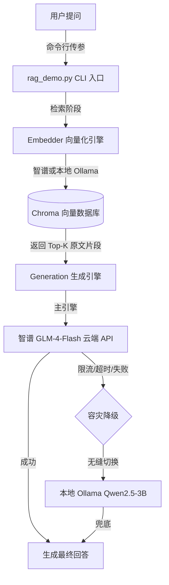

# AI-Agent-Harness (AI Agent 工具链与混合工作流实战记录)
## 🏗️ 系统架构图



## 💡 项目背景

本项目是一个软件工程学生主导的**全链路 AI Agent 与高可用 RAG 系统实战记录**。在从零搭建智能助手的过程中，我深刻体会到了从“跑通玩具 Demo”到“构建生产级应用”之间的巨大鸿沟。

为了应对真实工程中的极端场景，我设计并实现了一套完整的混合推理架构，核心工程挑战与解决方案包括：

1. **检索与生成解耦（Retrieval-Generation Decoupling）**：系统支持云端智谱 API（高智商、快速）与本地 Ollama 3B（隐私、离线）的双引擎调度。通过严格区分 Embedder（负责查资料）与 Engine（负责写报告），实现了“本地离线检索 + 云端在线生成”的灵活混合模式。
2. **高可用容灾与降级（Fallback Strategy）**：针对云端 API 极易出现的限流、超时或断网问题，代码实现了自动降级机制。当主引擎（智谱）异常时，系统能在几十秒内无缝切换至本地 Ollama 模型兜底，保证 RAG 业务闭环 100% 的任务完成率。
3. **向量空间隔离与热更新**：针对智谱（2048维）与 Ollama（768维）向量空间不兼容的致命坑，实现了严格的元数据校验。在切换 Embedder 时强制触发 `--rebuild` 物理删除旧库并重建，彻底杜绝了返回语义错乱垃圾结果的风险。
4. **全链路工程化与安全交付**：克服了 Windows 下 Python 3.14 的依赖编译灾难，采用 `.venv` 虚拟环境隔离；通过 `.env` 与 `.gitignore` 实现敏感密钥的防泄漏管理；并编写了包含依赖分层缓存的 `Dockerfile` 与 `.dockerignore`，保证项目具备跨平台一键交付能力。
5. **深度可观测性排错**：基于 Harness Trace 轨迹定位了沙箱拦截、模型代码幻觉（对象解构错误）、跨进程通信（IPC）的 GBK 与 UTF-8 编码冲突等底层工程 Bug，沉淀了极具参考价值的排错复盘记录。

本仓库完整记录了从环境搭建、多模型路由、数据库演进（SQLite -> MongoDB）到高可用 RAG 系统落地的全过程，旨在分享“AI 辅助生成”与“人类工程审查”深度结合的最佳实践。

## 🚀 快速复现与运行指南
### 前置要求
*   Node.js >= 22.5.0（原生支持 `node:sqlite`）
*   Python >= 3.10
*   各大模型 API Key（DeepSeek / 智谱 GLM 等）
*   本仓库中的 `test.db` 数据库由 `init_db.js` 自动生成，请先执行初始化

### 运行演示脚本
1. **Node.js 版本（数据库初始化与查询）**：
   ```bash
   node init_db.js
   node query_student.js 2
   ```
2. **Python 版本（参数校验与异常捕获）**：
   ```bash
   python query_student.py 2
   python query_student.py abc
   python query_student.py
   ```
*注：本仓库根目录包含 Node.js 和 Python 混合验证脚本，分别对应不同阶段的排错实验。*

## 🔍 实战踩坑与解决案例

### 1. 沙箱环境限制与工具重构
* **现象**：Harness 沙箱拦截了 Python 解释器的外部调用，报错 `file access denied`。
* **解决**：顺应沙箱的安全规则，将工具重构为 Node.js 内置环境，兼顾了安全性与执行效率。
  

### 2. 轻量级模型代码幻觉与自我纠错失败
* **现象**：智谱 GLM-4-Flash 生成 Node.js 脚本时，错误地对字符串使用了对象解构赋值（`const { id } = '1002'`），导致参数变成 `undefined`，最终任务失败并产生错误引导（如误报“Not found”）。
* **现象**：让该模型尝试自我纠错时，它既无法识别逻辑错误，又因端口占用和环境模块隔离（沙箱导致的 `Cannot find module`）彻底放弃。
* **解决**：通过查看 Trace（轨迹）日志精准定位到参数异常，手动替换为 DeepSeek 后一次跑通，确立了“核心链路调用强推理模型”的策略。
  
  

### 3. 强推理模型修复与字符集编码排错
* **现象**：DeepSeek 接手后精准修复了代码，但首次请求时遇到 PowerShell 默认解码导致的乱码（`aæ...`）。
* **解决**：模型主动分析出是 `Content-Type: text/plain` 未声明字符集导致，随后添加 `charset=utf-8` 并重启服务，成功获取“李四”。完成后还主动执行 `job_kill` 清理了后台进程，展现了优秀的资源生命周期管理能力。
  
  
  

### 4. 外部 API 集成与合规审批
* **现象**：在开发 GitHub Issue 抓取脚本时，需要将英文标题翻译为中文。
* **解决**：Agent 严格遵守 `AGENTS.md` 规则，先输出计划并获得人工批准后才写入文件。同时，它识别到国内网络环境对 Google 翻译的限制，成功集成了 MyMemory 免费翻译 API。
  
  

### 5. 数据库依赖风险与零依赖改造
* **现象**：创建 SQLite 数据库时，Agent 原本计划使用 `better-sqlite3`，但这在 Windows 下属于原生 C++ 模块，存在编译失败风险。
* **解决**：我果断介入，要求修改方案。Agent 随即检查 Node 版本（v24.21.0），改用内置的 `node:sqlite` 模块。最终成功建表、插入数据并查询出 `id=2` 的学生为“李四”，实现了零外部依赖部署。
  
  

### 6. 生成与执行解耦（混合工作流闭环）
* **现象**：由于 Harness 沙箱的安全隔离，Agent 无法直接调用本地 Python 解释器运行脚本；同时 VS Code 静态检查器因为未识别本地解释器，对内置库 `sqlite3` 和 `os` 误报红线。
* **解决**：我采用了“生成与执行解耦”的混合工作流。让 Agent 专注生成代码，我则手动拉取代码到本地 VS Code，并在终端执行 `python query_student.py`，成功输出 `id 为 2 的学生名字是：李四`。这验证了代码逻辑的正确性，同时保证了系统的安全边界。
  
  

### 7. 边界测试与参数校验闭环
* **现象**：为了让脚本真正可用，我要求 Agent 为 `query_student.py` 增加命令行参数校验，并且必须包含友好的错误提示。
* **解决**：Agent 自主引入了 `sys.argv` 和 `parse_id` 函数，并主动执行了 4 组边界测试（无效 ID、正常查询、非数字输入、无参数输入），全部通过。这验证了我在 `AGENTS.md` 中设定“先审批后执行”以及“参数化查询防 SQL 注入”的工程规范完全落地。
  

### 8. 上下文工程反思（元规则与任务规则的解耦）
* **反思**：最初我将代码约束（如“用 `sys.argv` 接收参数”）直接写进 `AGENTS.md`，导致 AI 在后续跨领域任务时产生了上下文污染和幻觉。
* **解决**：我将架构调整为 **“元规则 + 任务规则”** 的分离设计：`AGENTS.md` 仅保留全局安全与交互底线（如“先请示再执行”），具体的技术约束放在每次对话的 User Prompt 中。这不仅保证了系统上下文纯净，也大幅提升了 AI 的指令遵循准确率。

### 9. 多语言自适应翻译路由
* **现象**：最初翻译路由硬编码了 `hello`，且仅支持中英互译，无法处理日语、韩语、俄语等长尾需求。
* **解决**：
  1. 使用 `re.finditer` 替代 `re.search`，精准剥离“到日语/到俄语”等后缀，避免复杂句式（如“翻译到日语的内容”）误判。
  2. 建立 `LANG_NAME_TO_CODE` 映射表，兼容“日语/日文/chinese”等同义词。
  3. 实现**自适应双向翻译**（中英互译）与**定向多语言路由**（中文转日/俄/韩）。
  4. 加入“同语言保护”（源语言==目标语言时直接拦截，不发无效请求）及空内容边界处理。
  5. 在本地 VS Code 真实执行了 7 组测试用例（含空输入、中英混杂、多语言），全部通过。
  

### 10. 数据库平滑演进（SQLite -> MongoDB）
* **现象**：随着 Agent 工具链复杂化，需要存储动态 JSON 结构和非结构化日志。关系型数据库（SQLite/MySQL）的严格表结构显得繁琐。
* **解决**：我主导了数据库选型变更，从 SQLite 迁移到文档型数据库 **MongoDB**。
  1. 使用 `pymongo` 库重写 `init_db.py` 和 `query_student.py`。
  2. 连接信息严格从环境变量 `MONGO_URI` 读取，避免硬编码。
  3. 数据以 JSON 文档格式存储（`{"id": 1, "name": "张三"}`），契合 AI 领域数据结构多变的特性。
  4. 在本地 VS Code 真实运行，成功建库、插入 3 条数据并精准查询出 id=2 的“李四”。
  

### 11. RAG 双引擎降级与向量空间隔离实践
* **现象**：为了实现数据隐私兜底，我设计了云端智谱与本地 Ollama 的双引擎架构。但在实际测试中遇到了 `Collection expecting embedding with dimension of 2048, got 768` 的向量空间冲突问题，且故意注入无效 Key 时系统需要自动降级。
  
* **解决**：
  1. 在代码中加入严格的 `embedder` 元数据校验，若切换 Embedding 引擎，强制要求 `--rebuild` 重建向量库，防止返回语义错误的垃圾结果。
     
  2. 设计 `try-except` 降级机制。当智谱 API 返回 401 鉴权错误或超时时，自动捕获异常并切换至本地 Ollama 3B 模型。
  3. 实测在纯 CPU 环境下，本地模型推理耗时 71.1s，虽然较慢，但完美保证了断网环境下的系统可用性。
     

### 12. 双引擎容灾演练与资源占用实测
* **现象**：为了验证系统的高可用性，我进行了两组真实测试。第一次不加参数运行，智谱因网络波动超时，系统自动降级到本地 Ollama（耗时 72 秒成功返回）；第二次强制指定 `--engine zhipu` 运行，智谱再次超时，系统严格执行“快速失败”策略，报错退出并拒绝降级。
  
  
* **解决与反思**：
  1. 验证了 `auto` 模式下的无缝降级机制，保证了系统在断网/API故障时依然可输出。
  2. 验证了 `--engine zhipu` 参数下的 Fail-fast 机制，保证了在生产核心链路中，问题可以被立刻暴露而不是被掩盖。
  3. 实测了本地 Ollama 的硬件开销。在 16GB 内存的机器上，加载 qwen2.5-3b 模型推理时，内存占用峰值达到 11.4GB（可用 4.2GB），但 CPU 占用仅 11%。这验证了本地模型推理是“内存密集型”而非“计算密集型”任务，对硬件配置有明确要求。
  

### 13. RAG 系统边界测试与容灾机制
在完成双引擎架构后，我针对系统进行了极限边界测试，以确保在真实生产环境下的高可用性。测试涵盖了故障降级、索引重建、全离线运行及参数矩阵控制。

1. **快速失败（Fail-fast）机制**
   * **现象**：模拟智谱 API 超时，且明确指定 `--no-fallback` 禁止降级。
   * **解决**：系统严格执行指令，立即捕获异常并报错退出（退出码 2）。这适用于“必须使用高精度模型，严禁劣质降级”的核心业务链路，确保故障能被迅速暴露而非掩盖。
     

2. **知识库热更新与索引重建**
   * **现象**：随着业务扩充，知识库从 181 个片段增长至 362 个片段。
   * **解决**：运行 `python rag_demo.py --rebuild`，系统自动丢弃旧索引，重新切分并向量化 362 个片段，耗时仅 6.2 秒。这证明了系统具备高效的知识库迭代能力。
     

3. **全离线隐私模式**
   * **现象**：在断网或数据绝对涉密的场景下，需要完全切断云端 API。
   * **解决**：通过 `--engine ollama --embedder ollama` 参数，系统全链路使用本地模型（Qwen2.5-3B + nomic-embed-text）。实测纯 CPU 推理生成耗时 47.8 秒，虽然牺牲了速度，但保证了 **100% 的数据隐私安全**。
     

4. **CLI 容灾参数矩阵**
   * 系统支持完整的命令行参数控制，涵盖常规运行、强制云端、全离线、禁用降级及仅重建索引等场景，极大提升了工程调试的灵活性。
     

### 14. 多引擎混合调度与容灾实测（Retrieval-Generation 解耦）
在验证双引擎架构时，我进行了极端场景测试，重点验证了“检索”与“生成”解耦的工程价值。

1. **本地 Ollama 建库与向量检索**
   * **现象**：为了避免云端 API 限流导致的建库失败，我使用 `--embedder ollama --rebuild` 在本地重建向量库。
   * **解决**：实测 181 个片段在纯 CPU 环境下耗时 73.8 秒完成向量化。后续提问时，本地检索 4 个片段仅耗时 0.06 秒，实现了极速的离线检索。
     
     
2. **检索与生成的交叉解耦与上下文注入（架构亮点）**
   * **现象**：使用 `--show-prompt` 参数，我打印出了最终发给大模型的完整 Prompt。代码将本地 Ollama 检索到的 Top-K 文本片段、系统角色规则和用户问题，通过模板拼接成了一份“开卷考试的参考资料”。
   * **解决**：拼接好的 Prompt 被交给智谱 glm-4-flash 生成回答（实测耗时 20.1 秒）。这证明了在我的架构中，“谁查资料（本地 Ollama）”和“谁写报告（云端智谱）”可以独立解耦与动态调度，兼顾了本地检索的隐私安全与云端生成的智商优势。
     
     

### 15. 多智能体协作与 Agent Loop 防死循环实践（LangGraph）
* **现象**：普通的 RAG 是一次性线性检索，缺乏自我反思和重试能力。企业级 Agent 必须具备“规划-执行-审查-重试”的循环，但必须严格防止死循环。
* **解决**：
  1. 基于 `langgraph` 的 `StateGraph` 构建了两个协作 Agent：`Retriever`（检索）与 `Reviewer`（审查）。
  2. 通过 **条件边（Conditional Edge）** 实现打回重试：Reviewer 认为资料不达标时，会将 `feedback` 回传给 Retriever 深挖邻居文档。
  3. **设计了防死循环止损机制**：加入 `retry_count` 计数器，超过 2 次未通过（如知识库缺失的“视频生成”问题），状态机触发 `give_up` 安全退出。
  4. 实测 3 组用例，完整覆盖“一次通过”、“打回后通过”与“重试耗尽安全退出”的工程边界，断言结果全部符合预期。
  
     
## 🚀 核心收获
1. 掌握了基于 Trace（轨迹）定位 AI 工具调用失败原因的方法。
2. 体验并理解了本地沙箱隔离、文件系统观察策略（`FS_NOT_OBSERVED`）对 Agent 安全的重要性。
3. 掌握了“AI 生成 + 本地 IDE 验证”的混合工作流，实现了生成与执行的安全解耦。
4. 具备了对 AI 生成代码进行工程审查（防 SQL 注入、资源释放、异常捕获）的实战能力。

## 💻 技术栈
* Python (AI 辅助生成与调试)
* Node.js (内置模块开发)
* 大模型 API (DeepSeek / GLM-4-Flash)
* **容器化交付**：提供基于 `python:3.11-slim` 的 `Dockerfile` 与 `.dockerignore`。引入依赖分层缓存优化构建速度，并预留了环境变量注入（`MONGO_URI`）入口，支持 Docker 环境一键部署。
  
## 📈 后续规划
- [ ] 支持自动捕获不同语言（Node.js、Python）的报错堆栈。
- [ ] 实现多模型路由：简单报错用轻量模型，复杂错误路由给强模型降本增效。
